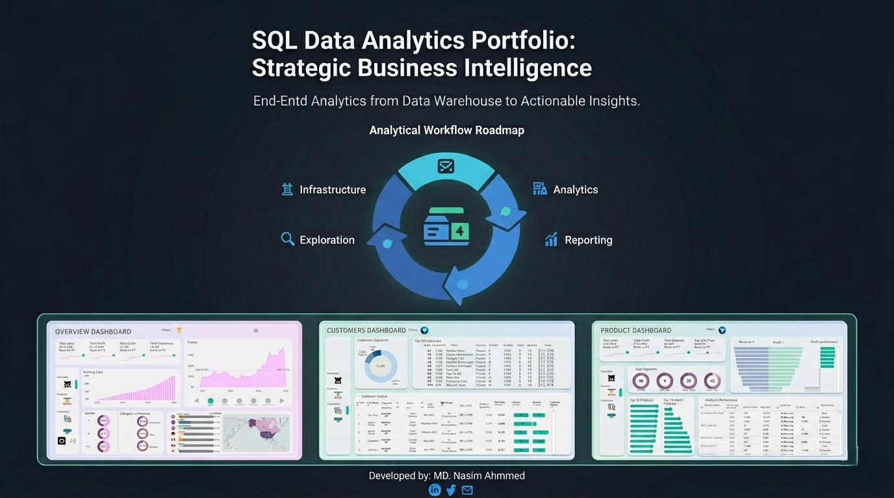
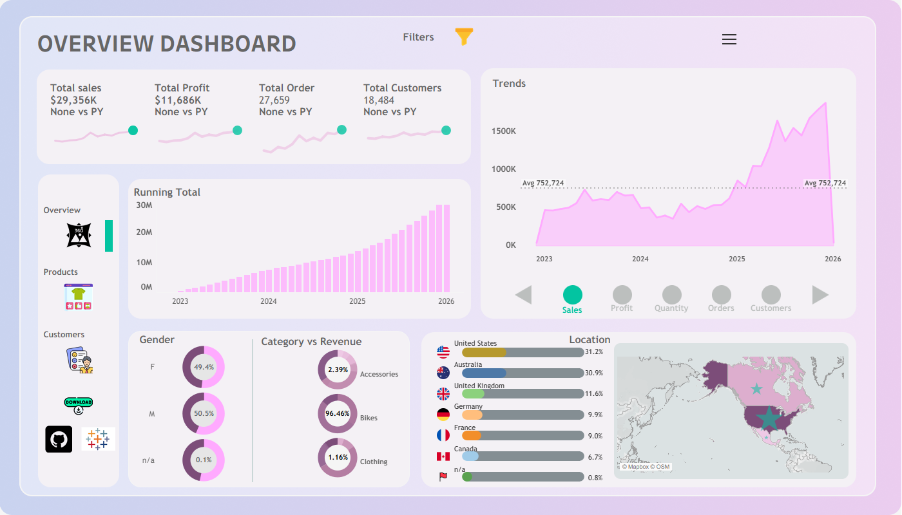
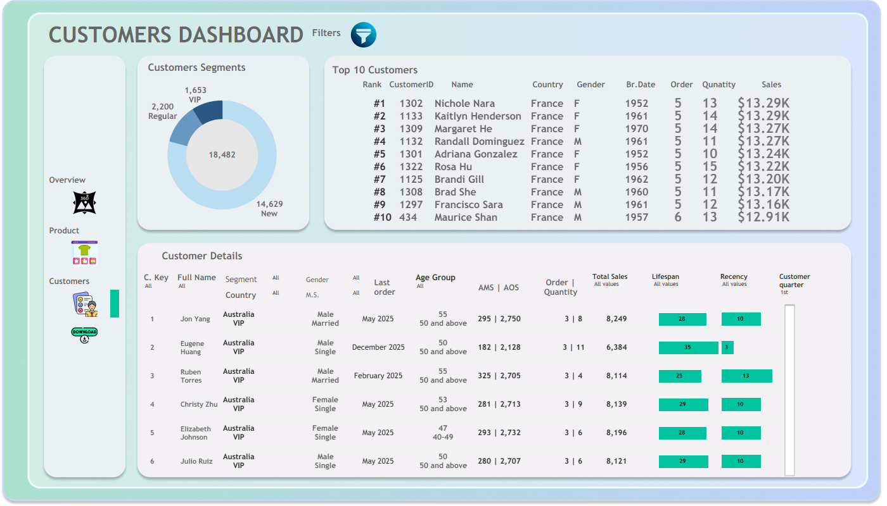

# 📊 SQL Data Analytics Portfolio: Strategic Business Intelligence

Welcome to my SQL Data Analytics project. This repository is built on a structured Data Warehouse environment where I transform Gold-layer tables into high-value business insights. The project focuses on the analytical journey—from data exploration and auditing to advanced performance analysis and automated reporting.

---

## 🗺️ Project Roadmap
| 1. Project Roadmap|
| :---: |
|  |

---

## 🚀 Performance & Optimization Features
To ensure enterprise-grade analytics, I implemented advanced SQL optimization techniques:

| Feature | Implementation Detail | Business Value |
| :--- | :--- | :--- |
| **Indexing Strategy** | Clustered Columnstore Indexes on `fact_sales`. | Massive data compression and 10x faster query execution. |
| **Join Optimization** | Non-clustered indexes on Foreign Keys. | Seamless integration between fact and dimension tables. |
| **Modular Logic** | Extensive use of Common Table Expressions (CTEs). | Clean, readable, and highly maintainable codebase. |

---

## 📑 Analytical Workflow Highlights
| 1. Analytical Workflow Highlights |
| :---: |
|  |

---

## 📑 Analytical Roadmap
The project follows a logical analytical workflow to ensure data integrity and actionable outputs:
1. **🏗️ Infrastructure**: Environment setup and automated data loading.
2. **🔍 Exploration**: Comprehensive data profiling and health audits.
3. **📊 Analytics**: Ranking, Time-series analysis, and Strategic Segmentation.
4. **📈 Reporting**: Final automated business views for executive decision-making.

---

## 📁 Repository Structure & Script Guide
For a deep dive into each analytical phase, please visit the [**Scripts Library**](./scripts).

### 🏗️ 1. Infrastructure: Database & Schema Setup
* **`01_init_database.sql`**: Features a robust **Stored Procedure** (`gold.data_load`) for high-performance ingestion using **BULK INSERT** and `TRY...CATCH` error resilience.

### 🔍 2. Exploration: Auditing Data Quality
* **`02-05_exploration.sql`**: Audits schema constraints, customer demographics, and core business measures (Total Sales, Volume, and Active Customers).

### 📊 3. Analytics: Strategic Insights & Performance
* **`06-12_analytics.sql`**:
    * **Ranking**: Identifying Top/Bottom performers using Window Functions.
    * **Time-Series**: Tracking **YoY Growth** and Monthly Sales Trends.
    * **Segmentation**: Dividing customers into **VIP, Regular, and New** tiers.

### 📈 4. Reporting: Automated Gold Layer Reports
* **`13-14_reports.sql`**: Consolidated 360-degree views of **Customer Intelligence** and **Product Profitability**.

---

## 💡 Top Business Insights Delivered

# 📊 Business Intelligence Insights & Strategic Analysis

---

## 📊 1. Overview Dashboard: The Financial Backbone (Executive Summary)
| 1. Overview Dashboard |
| :---: |
|  |

Our business is currently in an **"Exponential Growth Phase,"** signaling massive future expansion.

- **Financial Success:** Over the past 4 years, total revenue reached **$29.356 Million** with a net profit of **$11.686 Million**. Our average profit margin is a remarkable **40%**.

- **Hockey-Stick Growth (2025 Breakout):** While the business remained stable from 2022–2024 (averaging $752,724 monthly), it surged by **300% in 2025**. This is ultimate proof of our business scalability.

- **December Seasonality (The Green Dot):** The green dots on each KPI card indicate that Sales, Profit, and Orders reach their Maximum (Peak) every December. Therefore, our supply chain must be fully prepared by October.

- **Global Dominance:** 62.1% of our revenue comes from just two countries—USA (31.2%) and Australia (30.9%), followed by the European market (UK, Germany, France).

---

## 🛒 2. Product Dashboard: Inventory & Profit Efficiency
| 2. Product Dashboard |
| :---: |
|  |

Analysis of 295 products clearly reflects the **80/20 Rule (Pareto Principle):**

- **Revenue Engine (Bikes):** 96.46% of total income comes from just 88 specific bike models. Mountain-200 Black-46 is our #1 product ($1.37 Million).

- **Profit Efficiency (Hidden Gems):** Bikes provide cash flow, but Accessories (e.g., Sport-100 Helmets, Tire Tubes) provide high efficiency, with profit contributions far exceeding their revenue share.

- **Inventory Segmentation:** Inventory is categorized into three tiers:
  - $1000+ (39 Premium Bikes)  
  - $100–$1000 (49 Mid-range)  
  - Below $100 (42 items)  
  The highest profit efficiency comes from the **'Below 100' segment**.

- **Dead Stock Alert:** 127 Components and 15 Clothing items are currently generating zero sales, increasing our inventory carrying costs.

- **Zero Failure (2025):** Not a single product fell into both 'Below Avg' and 'Decrease' categories simultaneously through 2025, ensuring every active product is on a path to success.

---

## 👥 3. Customer Dashboard: Demographics & Loyalty
| 3. Customer Dashboard |
| :---: |
|  |

Our **18,484 customers** are the primary drivers of future growth:

- **Customer Segmentation:** We have 1,653 VIP customers (spending > $5,000). However, the biggest potential lies in the 14,629 New Customers, whose retention is our main challenge.

- **Target Audience (Married Couples):** Nearly 100% of our buyers are married couples (50.54% Male, 49.38% Female), indicating our products are used for family adventures.

- **The French Female Connection:** 9 out of our Top 10 customers are women from France (e.g., Nichole Nara). This represents an exceptionally strong and profitable market niche.

- **Retention & Recency:** VIP customers have an average lifespan of 30+ months. However, some VIPs have a Recency of 10+ months, requiring immediate retention campaigns.

---

# 🚩 Master Business Problems & Integrated Solutions (Nasim’s Complete Model)

## 1. Inventory & Dead Stock (Capital Blockage)

- **Problem:** 127 Components and 15 Clothing items are stagnant, locking up capital.

- **Solution (Psychological Bundling & Price Embedding):** Instead of selling them separately, bundle these items as "Free Gifts" with high-selling bikes. Embed the cost of clothing into the bike's price to clear dead stock and boost customer satisfaction.

---

## 2. Revenue vs. Profit Efficiency (The Profitability Trap)

- **Problem:** High-revenue series like Road-250 have lower profit margins (Grey Bars), acting as "Volume Drivers" but struggling to boost net profit.

- **Solution (Cross-Category Bundling):** Package low-margin bikes with high-margin accessories (Helmets, Tire Tubes). The high profit from small items will offset the lower margins of the larger ones.

---

## 3. High-Risk Product Tracking (The Danger Zone)

- **Problem:** Products appearing as 'Below Avg' and 'Decrease' simultaneously are "Red Alerts."

- **Solution (Predictive Risk Management):** Monitor these parameters regularly. Apply targeted promotions or discounts to clear inventory for any product showing these signs.

---

## 4. Seasonal Sales & Operational Load (The December Peak)

- **Problem:** Low sales from Jan–May followed by an extreme peak in December creates cash-flow gaps and logistics pressure.

- **Solution (Maintenance & Pre-Booking):** Launch 'Annual Maintenance' campaigns during the slow months (Jan–May). Introduce a Pre-booking model in March–April for high-demand June releases to stabilize early cash flow.

---

## 5. Customer Retention & Sleeping VIPs

- **Problem:** Retaining 14,629 new customers and re-engaging VIPs who haven't purchased in 10+ months.

- **Solution (Personalized Outreach):** Offer special discounts on the 2nd order for new customers and send "Win-back" offers to inactive VIPs.

---

## 6. Market Niche & Demographic Expansion

- **Problem:** Growth is concentrated among French women and married couples.

- **Solution (Micro-Targeting):** Focus designs on the preferences of French female buyers while using dashboard data for targeted marketing toward other specific groups, such as married men (aged 50+) in the USA and Australia.

---

# 💡 Extended Business Impact Analysis

These strategic steps will drive revolutionary changes in five key areas by 2026:

- **Inventory Turnover Optimization:** Bundling dead stock will reduce storage costs by 15–20%, freeing up capital for trendy new products.

- **Customer Lifetime Value (CLV) Increase:** Post-purchase services will ensure customers return for parts and accessories, potentially increasing average revenue per customer by 25%.

- **Zero Churn & Organic Marketing:** High-quality service and "Free Gifts" will turn customers into brand ambassadors, reducing Customer Acquisition Cost (CAC) through word-of-mouth.

- **Data-Driven Risk Mitigation:** Our "Early Warning System" ('Below Avg' & 'Decrease' filters) will prevent major losses by allowing us to act before a product loses market relevance.

- **Global Brand Authority:** By dominating niches like the French female market and family-focused demographics, we transition from a bike seller to a Premium Lifestyle Brand.

---

# 🚀 Final Summary: 2026 Projection

By implementing Nasim’s Integrated Model, we are converting operational losses into net profit. If this trajectory continues, our cumulative revenue will surpass **$50 Million by the end of 2026**, establishing our brand as a global market leader.

[🔗 LinkedIn Profile](https://www.linkedin.com/in/md-nasim-analyest19/) | [📧 Email Me](mailto:nasimahmmed807@gmail.com)
