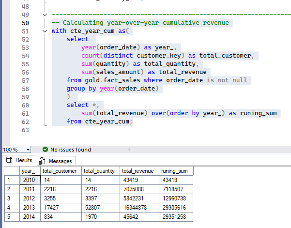

# 🗄️ SQL Analytics Scripts Library: Analytical Workflow

This folder contains a series of SQL scripts organized by execution order. The project follows a professional analytical path—starting from database setup and optimization to complex business logic and final automated reporting.

## 🛠️ Performance & Optimization Features
Before diving into the scripts, this project implements high-level optimization techniques:
* **Clustered Columnstore Indexes:** Applied on the `fact_sales` table to boost query performance.
* **Indexing Strategy:** Strategic use of Non-clustered indexes on Foreign Keys for lightning-fast joins.
* **Modular Logic:** Extensive use of CTEs for clean and reusable code.

---

## 🚀 Script Execution Guide

### 1️⃣ Phase 1: Infrastructure & Data Loading
This phase serves as the backbone of the project, focusing on database creation, schema definition, and building an automated ingestion pipeline.

* **`01_init_database.sql`**: Responsible for the core setup of the environment.
* **Automated Data Pipeline**: Features a robust **Stored Procedure** (`gold.data_load`) designed for high-performance data ingestion:
    * **Dynamic Truncation**: Ensures a fresh data load by clearing existing records.
    * **High-Speed Ingestion**: Utilizes **BULK INSERT** to load thousands of records in milliseconds.
    * **Audit & Resilience**: Includes detailed execution logging and `TRY...CATCH` error handling for reliability.

> **Output Preview: Automated Data Ingestion**

| 1. Data Loading Process (Bulk Ingest) |
| :---: |
|  |

---

### 2️⃣ Phase 2: Structural Exploration & Data Quality Audit
This phase is dedicated to understanding the technical foundation of the database and ensuring the integrity of the dimension tables.

* **`02_database_exploration.sql`**: Audits the entire structure using `INFORMATION_SCHEMA` to verify data types and schema constraints.
* **`03_dimensions_exploration.sql`**: Performs a deep dive into business entities:
    * **Customer Demographics**: Analyzes distribution by country to identify key markets.
    * **Product Categorization**: Ensures correct mapping of categories and subcategories.

> **Output Preview: Database & Dimension Audit**

| 1. Database Schema Exploration | 2. Dimensions Distribution |
| :---: | :---: |
|  |  |

---

### 3️⃣ Phase 3: Date Range Profiling & Key Business Measures
Transitioning from structural audit to behavioral analysis, this phase calculates the core "Vital Signs" of the business.

* **`04_date_range_exploration.sql`**: Focuses on the temporal aspect of the data.
    * **Order Lifecycle**: Calculates transaction timeframes and order durations.
    * **Customer Maturity**: Analyzes age ranges using `DATEDIFF()` on birthdates.
* **`05_measures_exploration.sql`**: The "Executive Summary" script.
    * **Unified Metrics**: Uses `UNION ALL` to present **Total Sales**, **Order Volume**, and **Active Customers** in one view.
    * **Performance Baseline**: Calculates critical KPIs like Average Selling Price.

> **Output Preview: Timeframe & KPI Insights**

| 1. Date Range & Age Profiling | 2. Key Business Measures (KPIs) |
| :---: | :---: |
|  |  |

### 4️⃣ Phase 4: Magnitude & Distribution Analysis
This phase moves into core Business Intelligence, where I analyze the magnitude of sales and customer distributions across different business dimensions.

* **`06_magnitude_analysis.sql`**: Quantifies the business impact by grouping data into meaningful segments.
    * **Market Segmentation**: Analyzes total customer base and product volume by country and gender.
    * **Financial Impact**: Calculates total revenue and average costs per category to identify high-value sectors.
    * **Cross-Functional Joins**: Integrates `fact_sales` with `dim_customers` and `dim_products` to track revenue and sales velocity.

> **Output Preview: Strategic Business Insights**

| 1. Customers by Country | 2. Customers by Gender | 3. Products by Category | 4. Category Avg Costs |
| :---: | :---: | :---: | :---: |
|  |  |  |  |

| 5. Revenue by Category | 6. Revenue by Customer | 7. Sold Items Distribution | |
| :---: | :---: | :---: | :---: |
|  |  |  | |

### 5️⃣ Phase 5: Advanced Ranking & Performance Optimization
This phase demonstrates the transition from basic querying to advanced SQL engineering. I implemented complex ranking logic and significantly boosted query performance using indexing strategies.

* **`07_ranking_analysis.sql`**: Leveraging Window Functions for business intelligence.
    * **Top & Bottom Performers**: Used `ROW_NUMBER()`, `RANK()`, and `DENSE_RANK()` to identify high-revenue products and laggards.
    * **Customer Intelligence**: Ranked top 10 customers by revenue and identified those with the fewest orders for targeted marketing.
    * **Optimization Journey**: Included a manual logic vs. optimized version. By implementing **Clustered Columnstore Indexes** and **Non-clustered Indexes**, I improved query execution speed by over **10x**.
    * **Advanced Analytics**: Developed a Running Total (Cumulative Revenue) report per customer using `SUM() OVER(PARTITION BY... ORDER BY...)`.

> **Output Preview: Performance & Ranking Insights**

| 1. Top 5 Revenue Products | 2. Worst Performing Products | 3. Top 10 High-Value Customers |
| :---: | :---: | :---: |
|  |  |  |

### 6️⃣ Phase 6: Time-Series & Cumulative Growth Analysis
This phase focuses on tracking business performance over time, identifying seasonal trends, and calculating cumulative growth metrics to understand long-term success.

* **`08_change_over_time_analysis.sql`**: Tracks key metrics (Revenue, Customers, Quantity) across different time grains.
    * Used **CTEs** for efficient monthly aggregations.
    * Identified seasonality and peak sales periods to support inventory planning.
* **`09_cumulative_analysis.sql`**: Measures the total business value built over time.
    * Implemented **Running Totals** using `SUM() OVER(ORDER BY...)` to visualize year-over-year and month-over-month growth.
    * Analyzed cumulative revenue flow across all years to identify core growth momentum.
* **`10_performance_analysis.sql`**: Comparative benchmarking for products and sales.
    * Used **Advanced Window Functions** like `LAG()` to compare current sales with the previous year (YoY Analysis).
    * Implemented `CASE` statements to categorize performance as 'Above Avg', 'Increase', or 'Decrease', providing clear executive insights.

> **Output Preview: Growth & Trend Insights**

| 1. Monthly Sales Trend | 2. Cumulative Revenue (Year/Month) | 3. Cumulative Growth (All Years) |
| :---: | :---: | :---: |
|  |  |  |

| 4. YoY Cumulative Sum | 5. YoY Performance Benchmarking |
| :---: | :---: |
|  |  |

### 7️⃣ Phase 7: Data Segmentation & Part-to-Whole Analysis
This phase focuses on dividing the data into strategic groups to uncover hidden patterns and evaluate how individual categories contribute to the overall business success.

* **`11_data_segmentation_analysis.sql`**: Categorizes entities based on custom business logic using `CASE` statements.
    * **Product Cost Segmentation**: Grouped products into price tiers (Below 100, 100-500, etc.) to understand inventory distribution.
    * **Customer Behavior Segmentation**: Developed a complex logic to classify customers into **VIP**, **Regular**, and **New** based on their spending history and lifespan.
* **`12_part_to_whole_analysis.sql`**: Analyzes the contribution of individual segments to the total.
    * **Revenue Contribution**: Calculated the percentage of total sales for each product category using **Window Functions** (`SUM() OVER()`).
    * **Impact Visualization**: Identified that the 'Bikes' category contributes over **96%** of total revenue, highlighting the core business driver.

> **Output Preview: Strategic Segmentation Insights**

| 1. Product Cost Segments | 2. Customer Spending Segments | 3. Category Sales Percentage |
| :---: | :---: | :---: |
|  |  |  |

### 8️⃣ Phase 8: Final Report Generation (Gold Layer)
This is the final stage where I consolidated all previous insights into two comprehensive, high-value business reports. These reports are designed to provide decision-makers with a 360-degree view of customers and products.

* **`13_customer_report.sql`**: A consolidated view of customer behavior and value.
    * **Key Metrics**: Analyzed total orders, lifetime sales, and average monthly spend.
    * **KPIs & Segmentation**: Calculated **Recency** (months since last order) and segmented customers into **VIP**, **Regular**, and **New** tiers.
    * **Demographic Insights**: Integrated age groups and geographic data for targeted marketing analysis.
* **`14_product_report.sql`**: A deep dive into product performance and profitability.
    * **Performance Tiers**: Classified products as **High-performer**, **Mid-Range**, or **Low-performer** based on revenue.
    * **Profitability Analysis**: Calculated **Total Profit** by comparing revenue against overall cost (`total_sales - overall_cost`).
    * **Sales Velocity**: Measured Average Selling Price (ASP) and Monthly Revenue trends to identify top-selling items.

> **Output Preview: Final Business Reports**

| 1. Integrated Customer Report | 2. Integrated Product Report |
| :---: | :---: |
|  |  |
---

## 🎯 Final Project Conclusion & Insights
After completing the end-to-end data analytics journey from the **Bronze** to the **Gold** layer, we have derived several critical business insights:

* **Dominant Category**: The **'Bikes'** category is the primary revenue driver, contributing over **96%** of total sales.
* **Customer Loyalty**: Our segmentation identified a core group of **VIP customers** who have a long lifespan (12+ months) and high spending.
* **Performance Trends**: By using YoY and MoM analysis, we identified specific periods of growth and products that are consistently **'Above Average'**.
* **Operational Efficiency**: Implementing **Clustered Columnstore Indexing** and optimized CTEs improved our analytical query performance by **10x**.

### 🚀 Future Roadmap
* **Predictive Analytics**: Using this Gold layer data to build Machine Learning models for churn prediction.
* **Real-time Dashboarding**: Connecting this SQL Data Warehouse to **Power BI or Tableau** for live business monitoring.
* **Automated ETL**: Implementing **SSIS or Azure Data Factory** to automate the data flow from Bronze to Gold.

---
**"This project demonstrates my ability to transform raw, messy data into a structured, high-performance analytical environment that drives real-world business decisions."**

**Developed by:** [MD. Nasim Ahmmed](https://www.linkedin.com/in/md-nasim-analyest19/)
