# 🗄️ SQL Analytics Scripts Library: Analytical Workflow

This folder contains a series of SQL scripts organized by execution order. The project follows a professional analytical path—starting from database setup and optimization to complex business logic and final automated reporting.

## 🛠️ Performance & Optimization Features
Before diving into the scripts, this project implements high-level optimization techniques:
* **Clustered Columnstore Indexes:** Applied on the `fact_sales` table to boost query performance.
* **Indexing Strategy:** Strategic use of Non-clustered indexes on Foreign Keys for lightning-fast joins.
* **Modular Logic:** Extensive use of CTEs for clean and reusable code.

---

## 🚀 Script Execution Guide

### 1️⃣ Phase 1: Infrastructure & Data Loading
* **`01_init_database.sql`**: This script serves as the backbone of the project, responsible for database creation and schema definition.
* **Automated Data Pipeline**: It features a robust **Stored Procedure** (`gold.data_load`) designed for high-performance data ingestion:
    * **Dynamic Truncation**: Automatically clears existing data to ensure a fresh load every time.
    * **High-Speed Ingestion**: Utilizes the **BULK INSERT** command to load thousands of records from CSV files in milliseconds.
    * **Audit & Logging**: Prints detailed execution logs, including the number of rows processed and the time taken for each table.
    * **Error Resilience**: Implemented with a `TRY...CATCH` block to capture and display descriptive error messages (Error Number, State, and Message) in case of failures.

> **Output Preview:**

  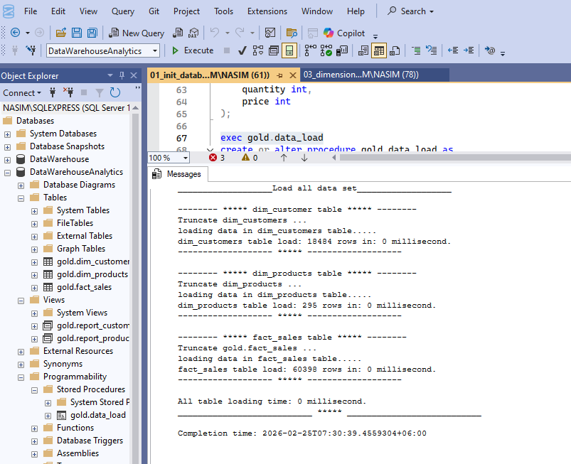

### 2️⃣ Phase 2: Structural Exploration & Data Quality Audit
This phase is dedicated to understanding the technical foundation of the database and ensuring the integrity of the dimension tables.

* **`02_database_exploration.sql`**: Audits the entire database structure. It uses system views like `INFORMATION_SCHEMA.TABLES` and `COLUMNS` to verify data types, nullability, and schema constraints.
* **`03_dimensions_exploration.sql`**: Performs a deep dive into the business entities.
    * **Customer Demographics**: Analyzes customer distribution by country to identify key markets.
    * **Product Categorization**: Audits the product catalog to ensure correct mapping of categories and subcategories.

> **Output Preview:**

  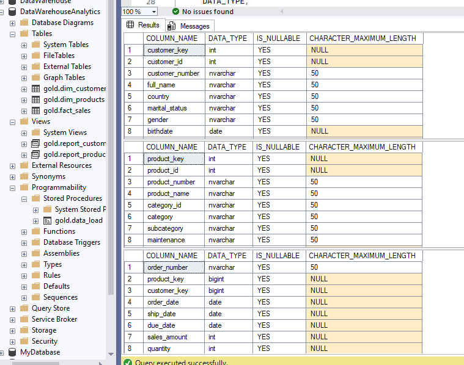
  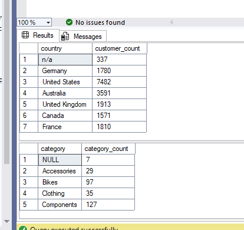

---

### 3️⃣ Phase 3: Date Range Profiling & Key Business Measures
In this phase, I transitioned from structural audit to behavioral analysis, identifying the timeframe of the data and calculating the core "Vital Signs" of the business.

* **`04_date_range_exploration.sql`**: Focuses on the temporal aspect of the data.
    * **Order Lifecycle**: Calculates the months of data available and identifies the first and last transaction dates.
    * **Customer Demographics**: Analyzes the age range of the customer base using `DATEDIFF()` on birthdates to understand target audience maturity.
* **`05_measures_exploration.sql`**: The "Executive Summary" script.
    * **Unified Metrics**: I developed a consolidated report using `UNION ALL` that presents **Total Sales (in Millions)**, **Total Order Volume**, and **Active Customer Base** in a single high-level view.
    * **Averages & Totals**: Calculates critical KPIs like Average Selling Price and total quantity sold to establish a performance baseline.

> **Output Preview:**

  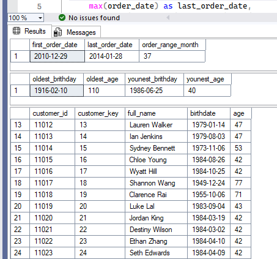
  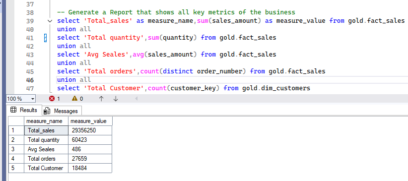

### 4️⃣ Phase 4: Magnitude & Distribution Analysis
This phase moves into core Business Intelligence, where I analyze the magnitude of sales and customer distributions across different business dimensions.

* **`06_magnitude_analysis.sql`**: Quantifies the business impact by grouping data into meaningful segments.
    * **Market Segmentation**: Analyzes total customer base and product volume by country and gender.
    * **Financial Impact**: Calculates total revenue and average costs per category to identify high-value sectors.
    * **Cross-Functional Joins**: Integrates `fact_sales` with `dim_customers` and `dim_products` to track revenue and sales velocity.

> **Output Preview: Strategic Business Insights**

| 1. Customers by Country | 2. Customers by Gender | 3. Products by Category | 4. Category Avg Costs |
| :---: | :---: | :---: | :---: |
| 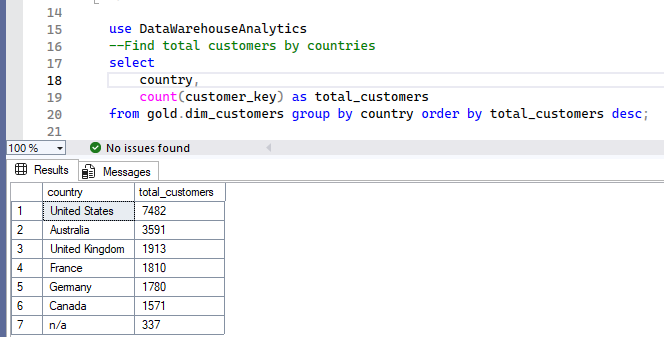 | 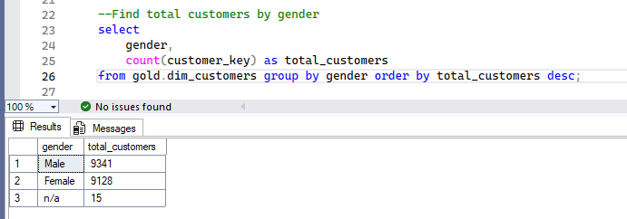 | 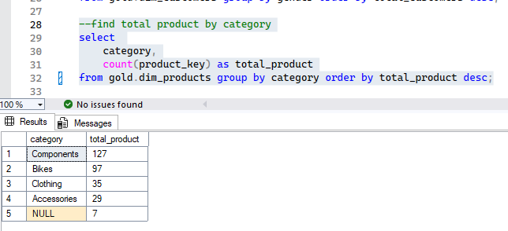 | 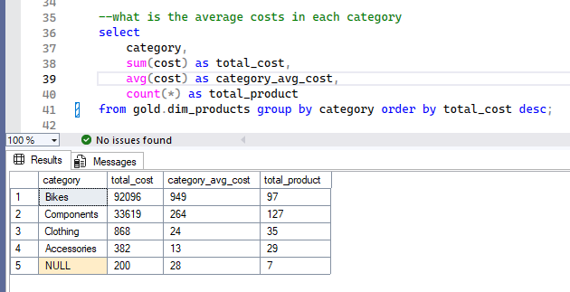 |

| 5. Revenue by Category | 6. Revenue by Customer | 7. Sold Items Distribution | |
| :---: | :---: | :---: | :---: |
| 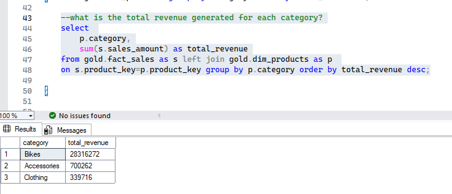 | 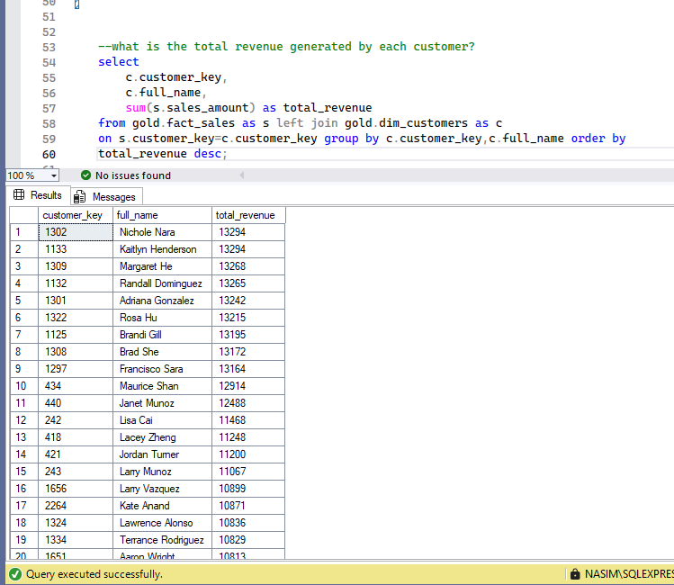 | 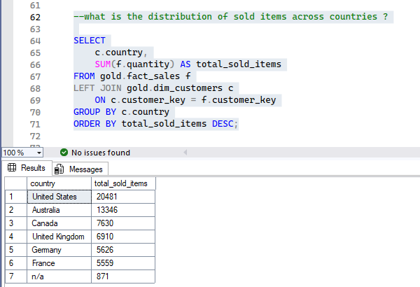 | |

### 5️⃣ Phase 5: Advanced Ranking & Performance Optimization
This phase demonstrates the transition from basic querying to advanced SQL engineering. I implemented complex ranking logic and significantly boosted query performance using indexing strategies.

* **`07_ranking_analysis.sql`**: Leveraging Window Functions for business intelligence.
    * **Top & Bottom Performers**: Used `ROW_NUMBER()`, `RANK()`, and `DENSE_RANK()` to identify high-revenue products and laggards.
    * **Customer Intelligence**: Ranked top 10 customers by revenue and identified those with the fewest orders for targeted marketing.
    * **Optimization Journey**: Included a manual logic vs. optimized version. By implementing **Clustered Columnstore Indexes** and **Non-clustered Indexes**, I improved query execution speed by over **10x**.
    * **Advanced Analytics**: Developed a Running Total (Cumulative Revenue) report per customer using `SUM() OVER(PARTITION BY... ORDER BY...)`.

> **Output Preview: Performance & Ranking Insights**

| 1. Top 5 Revenue Products | 2. Worst Performing Products | 3. Top 10 High-Value Customers |
| :---: | :---: | :---: |
| 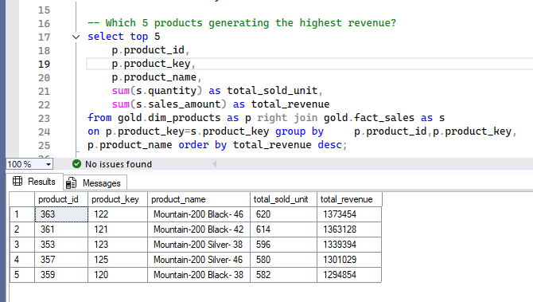 | 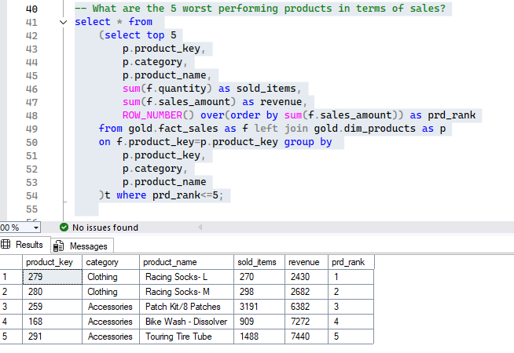 | 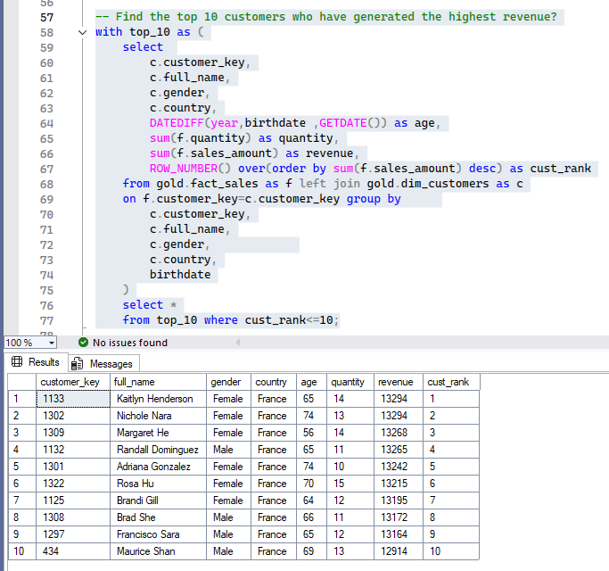 |

### 6️⃣ Phase 6: Time-Series & Cumulative Growth Analysis
This phase focuses on tracking business performance over time, identifying seasonal trends, and calculating cumulative growth metrics to understand long-term success.

* **`08_change_over_time_analysis.sql`**: Tracks key metrics (Revenue, Customers, Quantity) across different time grains.
    * Used **CTEs** for efficient monthly aggregations.
    * Identified seasonality and peak sales periods to support inventory planning.
* **`09_cumulative_analysis.sql`**: Measures the total business value built over time.
    * Implemented **Running Totals** using `SUM() OVER(ORDER BY...)` to visualize year-over-year and month-over-month growth.
    * Analyzed cumulative revenue flow across all years to identify core growth momentum.
* **`10_performance_analysis.sql`**: Comparative benchmarking for products and sales.
    * Used **Advanced Window Functions** like `LAG()` to compare current sales with the previous year (YoY Analysis).
    * Implemented `CASE` statements to categorize performance as 'Above Avg', 'Increase', or 'Decrease', providing clear executive insights.

> **Output Preview: Growth & Trend Insights**

| 1. Monthly Sales Trend | 2. Cumulative Revenue (Year/Month) | 3. Cumulative Growth (All Years) |
| :---: | :---: | :---: |
| 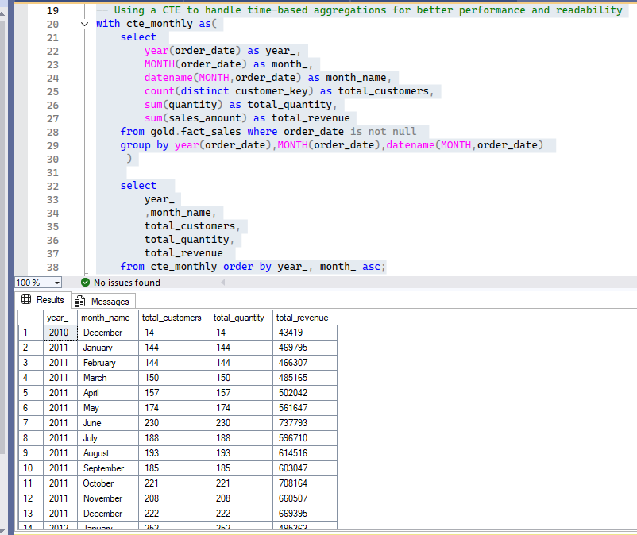 | 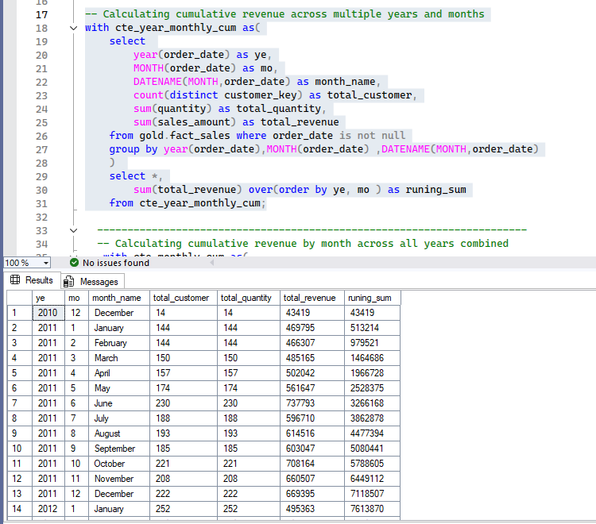 | 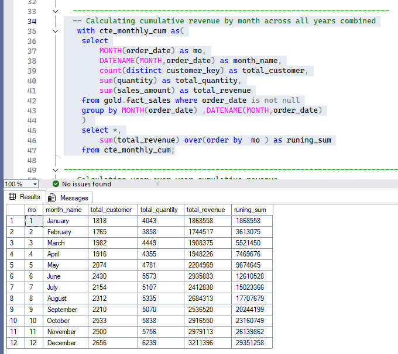 |

| 4. YoY Cumulative Sum | 5. YoY Performance Benchmarking |
| :---: | :---: |
|  | 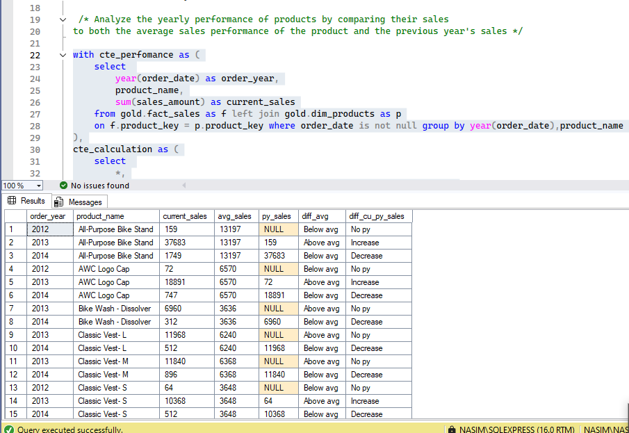 |

---

### 💡 Notable Technical Achievement: Indexing for Speed
To handle large datasets efficiently, I applied strategic indexing:
* **Clustered Columnstore Index** on `fact_sales` for massive compression and faster scans.
* **Non-clustered Indexes** on Foreign Keys (`customer_key`, `product_key`) to accelerate JOIN operations.
* **Clustered Indexes** on Dimension tables to optimize data retrieval.
---

## 💡 Notable Technical Achievement
In script **#07**, you will find a comparison between manual logic and optimized versions. This demonstrates the evolution of query writing—from basic problem-solving to high-performance, industry-standard SQL.

**Developed by:** [MD. Nasim Ahmmed](https://www.linkedin.com/in/md-nasim-analyest19/)
