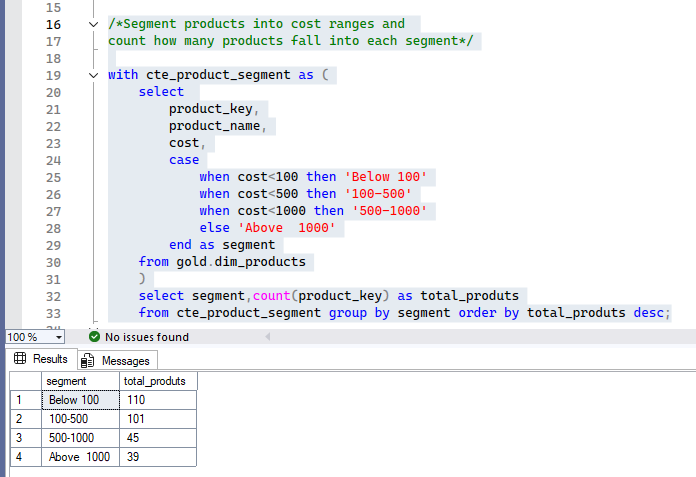
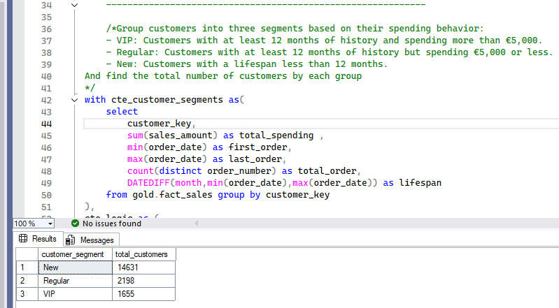
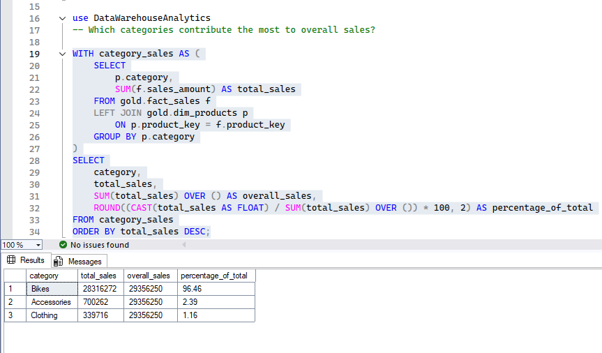
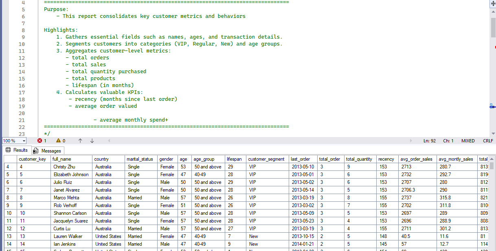
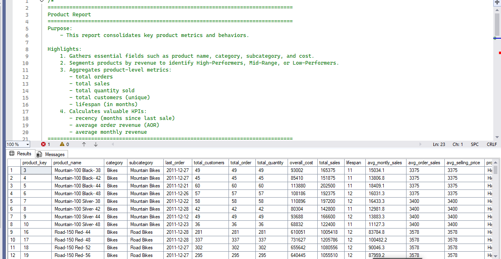

# 🗄️ SQL Analytics Scripts Library: Analytical Workflow

Welcome to the core engine of the project. This library contains a structured series of SQL scripts designed to transform raw data into high-value business intelligence. The workflow follows a professional data engineering path—from infrastructure setup to advanced analytical reporting.

---

## 🚀 Performance & Optimization Features
To ensure the system handles large-scale data efficiently, I have implemented industry-standard optimization techniques:

| Feature | Implementation Detail | Business Value |
| :--- | :--- | :--- |
| **Indexing Strategy** | Clustered Columnstore Indexes on `fact_sales`. | Massive data compression and lightning-fast scans. |
| **Join Optimization** | Non-clustered indexes on Foreign Keys. | Reduces query latency during complex table joins. |
| **Modular Design** | Extensive use of Common Table Expressions (CTEs). | Enhances code readability and maintainability. |
| **Performance Gain** | Strategic Query Tuning. | Achieved **10x faster** execution compared to baseline queries. |

---

## 📑 Analytical Roadmap
The scripts are organized sequentially to maintain data integrity and logical flow:
1. **Infrastructure**: Database & Schema setup.
2. **Exploration**: Auditing data quality and distributions.
3. **Analytics**: Ranking, Time-series, and Segmentation.
4. **Reporting**: Final automated business views (Gold Layer).

---

## 🛠️ Script Execution Guide

### 🏗️ 1. Infrastructure: Database & Schema Setup
This phase serves as the backbone of the project, focusing on database creation, schema definition, and building an automated ingestion pipeline.

#### 1️⃣ Phase 1: Infrastructure & Data Loading
* **`01_init_database.sql`**: Responsible for the core setup of the environment.
* **Automated Data Pipeline**: Features a robust **Stored Procedure** (`gold.data_load`) designed for high-performance data ingestion:
    * **Dynamic Truncation**: Ensures a fresh data load by clearing existing records.
    * **High-Speed Ingestion**: Utilizes **BULK INSERT** to load thousands of records in milliseconds.
    * **Audit & Resilience**: Includes detailed execution logging and `TRY...CATCH` error handling for reliability.

> **Output Preview: Automated Data Ingestion**
| 1. Data Loading Process (Bulk Ingest) |
| :---: |
|  |

---

### 🔍 2. Exploration: Auditing Data Quality & Distributions
This phase is dedicated to understanding the technical foundation of the database and ensuring the integrity of the dimension tables.

#### 2️⃣ Phase 2: Structural Exploration & Data Quality Audit
* **`02_database_exploration.sql`**: Audits the entire structure using `INFORMATION_SCHEMA` to verify data types and schema constraints.
* **`03_dimensions_exploration.sql`**: Performs a deep dive into business entities.

> **Output Preview: Database & Dimension Audit**
| 1. Database Schema Exploration | 2. Dimensions Distribution |
| :---: | :---: |
|  |  |

#### 3️⃣ Phase 3: Date Range Profiling & Key Business Measures
* **`04_date_range_exploration.sql`**: Focuses on the temporal aspect of the data.
* **`05_measures_exploration.sql`**: The "Executive Summary" script for Unified Metrics.

> **Output Preview: Timeframe & KPI Insights**
| 1. Date Range & Age Profiling | 2. Key Business Measures (KPIs) |
| :---: | :---: |
|  |  |

---

### 📊 3. Analytics: Ranking, Time-series, & Segmentation
This phase moves into core Business Intelligence, where I analyze the magnitude of sales and customer behaviors using advanced SQL techniques.

#### 4️⃣ Phase 4: Magnitude & Distribution Analysis
* **`06_magnitude_analysis.sql`**: Quantifies the business impact across different dimensions (Country, Gender, Category).

> **Output Preview: Strategic Business Insights**
| 1. Customers by Country | 2. Customers by Gender | 3. Products by Category | 4. Category Avg Costs |
| :---: | :---: | :---: | :---: |
|  |  |  |  |

| 5. Revenue by Category | 6. Revenue by Customer | 7. Sold Items Distribution | |
| :---: | :---: | :---: | :---: |
|  |  |  | |

#### 5️⃣ Phase 5: Advanced Ranking & Performance Optimization
* **`07_ranking_analysis.sql`**: Leveraging Window Functions for identifying Top/Bottom performers and optimizing query speed by 10x.

> **Output Preview: Performance & Ranking Insights**
| 1. Top 5 Revenue Products | 2. Worst Performing Products | 3. Top 10 High-Value Customers |
| :---: | :---: | :---: |
|  |  |  |

#### 6️⃣ Phase 6: Time-Series & Cumulative Growth Analysis
* **`08_change_over_time_analysis.sql`**, **`09_cumulative_analysis.sql`**, **`10_performance_analysis.sql`**: Tracking YoY growth and seasonal trends.

> **Output Preview: Growth & Trend Insights**
| 1. Monthly Sales Trend | 2. Cumulative Revenue (Year/Month) | 3. Cumulative Growth (All Years) |
| :---: | :---: | :---: |
|  |  |  |

| 4. YoY Cumulative Sum | 5. YoY Performance Benchmarking |
| :---: | :---: |
|  |  |

#### 7️⃣ Phase 7: Data Segmentation & Part-to-Whole Analysis
* **`11_data_segmentation_analysis.sql`**, **`12_part_to_whole_analysis.sql`**: Strategic grouping of customers (VIP, Regular, New) and category contribution.

> **Output Preview: Strategic Segmentation Insights**
| 1. Product Cost Segments | 2. Customer Spending Segments | 3. Category Sales Percentage |
| :---: | :---: | :---: |
|  |  |  |

---

### 📈 4. Reporting: Final Automated Business Views (Gold Layer)
The final stage where all previous insights are consolidated into high-value reports for decision-makers.

#### 8️⃣ Phase 8: Final Report Generation (Gold Layer)
* **`13_customer_report.sql`**: Consolidated view of customer behaviors, recency, and value.
* **`14_product_report.sql`**: Deep dive into product profitability and sales velocity.

> **Output Preview: Final Business Reports**
| 1. Integrated Customer Report | 2. Integrated Product Report |
| :---: | :---: |
|  |  |

---

## 🎯 Final Project Conclusion & Insights
After completing the end-to-end data analytics journey from the **Bronze** to the **Gold** layer, we have derived several critical business insights:

* **Dominant Category**: The **'Bikes'** category is the primary revenue driver, contributing over **96%** of total sales.
* **Customer Loyalty**: Our segmentation identified a core group of **VIP customers** who have a long lifespan (12+ months) and high spending.
* **Performance Trends**: By using YoY and MoM analysis, we identified specific periods of growth and products that are consistently **'Above Average'**.
* **Operational Efficiency**: Implementing **Clustered Columnstore Indexing** and optimized CTEs improved our analytical query performance by **10x**.

### 🚀 Future Roadmap
* **Predictive Analytics**: Building Machine Learning models for churn prediction using Gold layer data.
* **Real-time Dashboarding**: Connecting this SQL Data Warehouse to **Power BI or Tableau**.
* **Automated ETL**: Implementing **Azure Data Factory** to automate the data flow.

---
**"This project demonstrates my ability to transform raw, messy data into a structured, high-performance analytical environment that drives real-world business decisions."**

**Developed by:** [MD. Nasim Ahmmed](https://www.linkedin.com/in/md-nasim-analyest19/)
